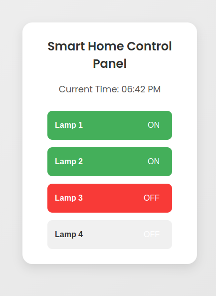
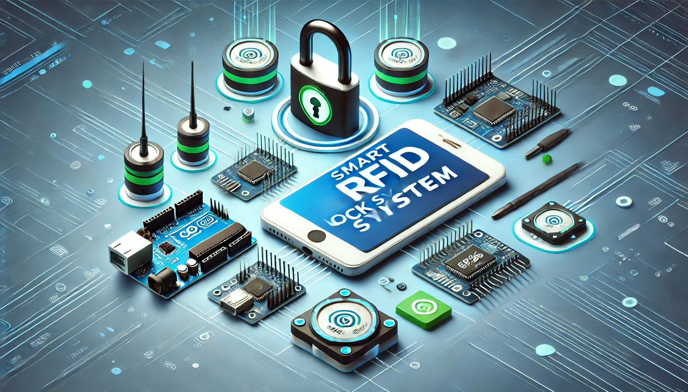
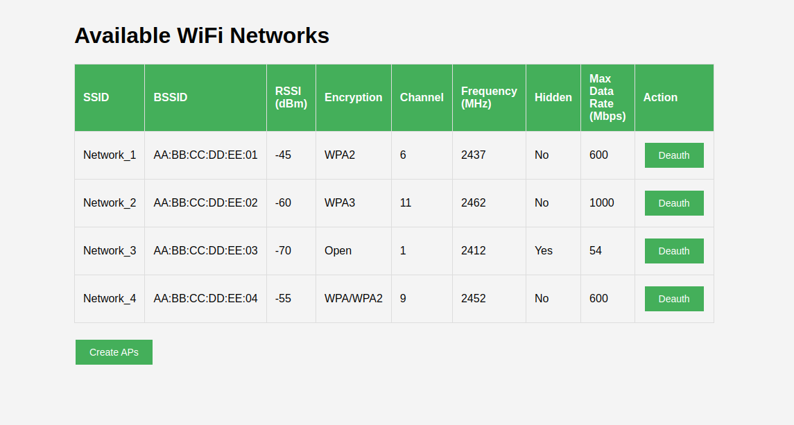
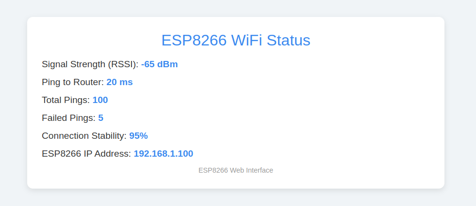

# Arduino Projects

This repository contains various Arduino-based projects, Below is a brief overview of each project included in this repository:

### 1. Smart Home Control Panel
This project creates a smart home control panel using an **ESP8266** microcontroller connected to a 4-slot relay. It allows you to control lamps or other electrical devices via a web-based interface in real-time. The panel also displays the current status of each device and the current time.

**Key Features**:
- Web-based relay control.
- Real-time device status updates.
- Simple wiring with a relay board.

[Read more](/smart_home/README.md)

---

### 2. Smart Lock System
This project involves building a smart lock using an **Arduino** and an **RFID** system. The system unlocks a door when a registered RFID tag is detected, providing a basic and secure electronic lock.

**Key Features**:
- RFID-based access control.
- Simple and secure door locking mechanism.

[Read more](smart_lock/README.md)

---

### 3. WiFi Attacker Tool
A project designed for educational purposes, this tool allows you to perform basic WiFi penetration testing using an **ESP8266** module. It can disconnect devices from the network and send de-authentication packets.

**Key Features**:
- Send de-auth packets to disrupt WiFi connections.
- Educational use for understanding WiFi security.

[Read more](wifi_attacker/README.md)

---

### 4. WiFi Monitor Tool
A WiFi monitoring tool that helps you track WiFi signal strength and network stability using an **ESP8266** and an **OLED display**. It displays network statistics and connection stability both on the OLED display and via a web interface.

**Key Features**:
- Real-time WiFi signal strength display.
- Web-based dashboard for network statistics.
- OLED panel for instant monitoring.

[Read more](wifi_monitor/README.md)

---

Each project is documented with instructions on setting up the hardware, installing the necessary software, and running the code. Feel free to explore the individual README files linked above for detailed guidance on each project!
