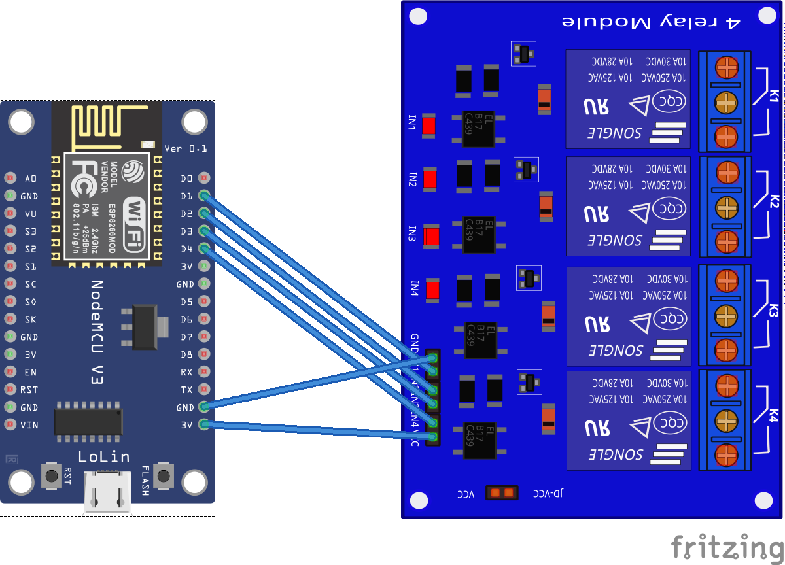

# Smart Home Control Panel

This project allows you to create a smart home control panel using an ESP8266 microcontroller connected to a 4-slot relay to control lamps (or other electrical devices) via a web-based interface. The panel provides real-time control over the relay state, allowing users to toggle the devices on and off from a browser. The web panel also displays the current time and status of each device.


## Installation Guide

### 1. **Wiring the ESP8266 to the 4-Slot Relay**

To wire the ESP8266 to the 4-slot relay, follow these steps:

- **ESP8266 Pinouts**:
  - Connect GPIO pins on the ESP8266 to the input pins on the relay board.
  
| Relay Pin | ESP8266 GPIO |
|-----------|--------------|
| IN1       | GPIO 5       |
| IN2       | GPIO 4       |
| IN3       | GPIO 0       |
| IN4       | GPIO 2       |
  
- **Power Connections**:
  - Connect the relay module's VCC to the 3.3V pin on the ESP8266.
  - Connect the relay module's GND to the GND pin on the ESP8266.



### 2. **ESP8266 Firmware & Library Installation**

Before uploading the code to your ESP8266, make sure you have the following software installed:

- **Arduino IDE**: You need the Arduino IDE to write and upload code to the ESP8266.
  - Download the Arduino IDE from [here](https://www.arduino.cc/en/software).
  
- **ESP8266 Board Installation**:
  1. Open the Arduino IDE.
  2. Go to `File > Preferences`.
  3. In the `Additional Board Manager URLs` field, add this URL:
     ```
     http://arduino.esp8266.com/stable/package_esp8266com_index.json
     ```
  4. Go to `Tools > Board > Board Manager`, search for `ESP8266`, and install the latest version.

- **Required Libraries**:
  - Install the following libraries from `Sketch > Include Library > Manage Libraries`:
    - `ESP8266WiFi`
    - `ESP8266WebServer`

### 3. **Uploading the Code to ESP8266**

- Open the provided ESP8266 code in Arduino IDE.
- In the code, make the following changes:

  - **Set the correct WiFi credentials** in the following section of the code:
    ```cpp
    const char* ssid = "your_SSID";
    const char* password = "your_PASSWORD";
    ```

  - **Set your ESP8266’s IP address** if necessary in this section (optional, the IP will be assigned automatically by your router if using DHCP):
    ```cpp
    WiFi.begin(ssid, password);
    ```

  - Upload the code to your ESP8266 by selecting the correct board (`Tools > Board > ESP8266`) and the correct COM port.

### 4. **Web Panel Setup**

- The HTML, CSS, and JavaScript files for the web panel are included. No additional installation is required.
- To modify the server IP, locate the following line in the HTML `<script>` tag:
  ```javascript
  fetch(`http://your-esp8266-ip/relay/${relay}/${action}`)
