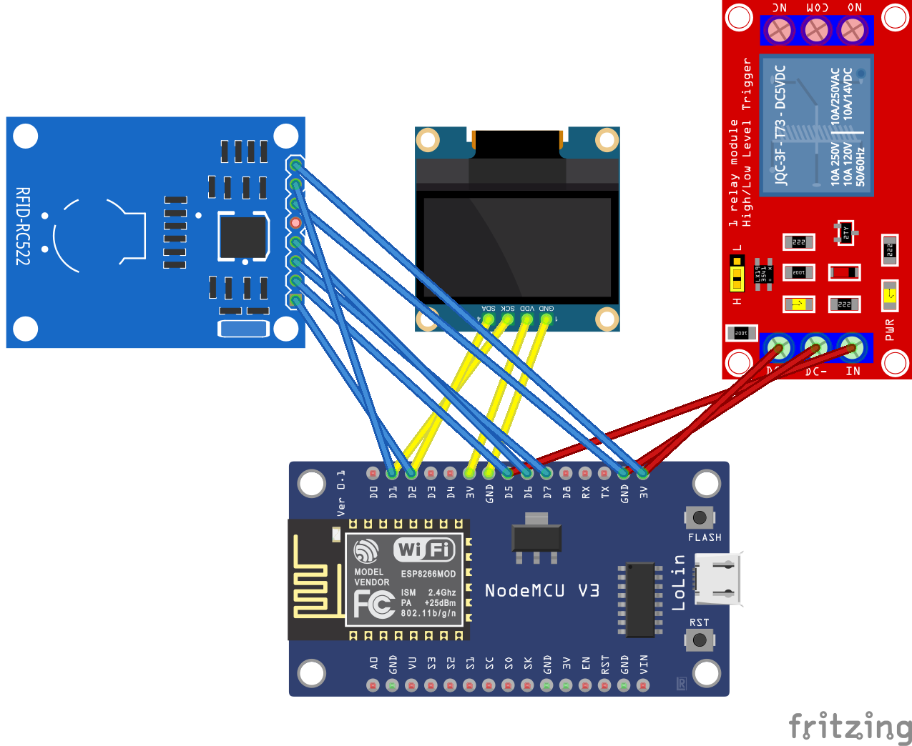

# Smart RFID Lock System

A RFID-based locking system using an ESP8266 microcontroller, MFRC522 RFID reader, LCD display, and an electromagnetic lock. This project allows for admin-controlled user management, access logging, and real-time status updates via an LCD panel.


## Table of Contents

1. [Project Overview](#project-overview)
2. [Components Required](#components-required)
3. [Circuit Diagram and Connections](#circuit-diagram-and-connections)
4. [Project Workflow](#project-workflow)
5. [Code Explanation](#code-explanation)
6. [Assembly Instructions](#assembly-instructions)
7. [Additional Resources](#additional-resources)

---

## Project Overview

The Smart RFID Lock System enables access control using RFID cards. An admin can add or remove user cards, and authorized users can unlock the door by scanning their RFID cards. The system feedback through an LCD display, showing actions like admin login, user addition, access granted or denied, and timestamps.

## Components Required

1. **ESP8266 Module (NodeMCU ESP8266 Development Board)**
2. **MFRC522 RFID Reader**
3. **12V Electromagnetic Door Lock**
4. **5V Relay Module**
5. **16x2 I2C LCD Display**
6. **12V 5A Power Adapter**

## Circuit Diagram and Connections

1. **ESP8266 (NodeMCU) Connections:**
   - **VCC:** Connect to 3.3V power rail.
   - **GND:** Connect to Ground.
   - **SDA (GPIO4 - D2):** Connect to MFRC522 SDA.
   - **SCK (GPIO14 - D5):** Connect to MFRC522 SCK.
   - **MOSI (GPIO13 - D7):** Connect to MFRC522 MOSI.
   - **MISO (GPIO12 - D6):** Connect to MFRC522 MISO.
   - **RST (GPIO5 - D1):** Connect to MFRC522 RST.
   - **D2 (GPIO4):** SDA for I2C LCD.
   - **D1 (GPIO5):** SCL for I2C LCD.
   - **D5 (GPIO14):** Control pin for Relay Module.

2. **MFRC522 RFID Reader:**
   - **SDA:** Connect to GPIO4 (D2) on NodeMCU.
   - **SCK:** Connect to GPIO14 (D5).
   - **MOSI:** Connect to GPIO13 (D7).
   - **MISO:** Connect to GPIO12 (D6).
   - **RST:** Connect to GPIO5 (D1).
   - **GND:** Connect to Ground.
   - **3.3V:** Connect to 3.3V on NodeMCU.

3. **16x2 I2C LCD Display:**
   - **VCC:** Connect to 5V (or 3.3V if compatible).
   - **GND:** Connect to Ground.
   - **SDA:** Connect to GPIO4 (D2) on NodeMCU.
   - **SCL:** Connect to GPIO5 (D1) on NodeMCU.

4. **Relay Module:**
   - **VCC:** Connect to 5V on NodeMCU.
   - **GND:** Connect to Ground.
   - **IN:** Connect to GPIO14 (D5) on NodeMCU.
   - **COM and NO:** Connect to the electromagnetic lock circuit.

5. **Electromagnetic Lock:**
   - **Positive (+):** Connect to the relay's Normally Open (NO) terminal.
   - **Negative (-):** Connect to the common Ground.
   - **12V Power:** Connect the positive lead through the relay and the negative lead directly to Ground.

6. **Power Supply:**
   - **12V Output:** Powers the electromagnetic lock and relay module.
   - **5V Output:** Powers the NodeMCU and peripherals. Use a separate 5V regulator if necessary.


---

## Project Workflow

1. **System Initialization:**
   - Initializes RFID reader, LCD display, Relay, and EEPROM.
   - Loads the admin UID and user UIDs from non-volatile memory (EEPROM).

2. **Admin Authentication:**
   - Waits for an RFID card scan.
   - If the admin card is detected, enters admin mode to add new users.

3. **User Management:**
   - In admin mode, scans a new RFID card to add it as a user.
   - Stores the new user's UID in EEPROM for future access control.

4. **Access Control:**
   - Scans user RFID cards.
   - If a scanned card matches a stored user UID, activates the electromagnetic lock to grant access.
   - If not, access is denied.

5. **Status Display:**
   - Updates the LCD with relevant messages such as "Admin Login", "Adding New User", "Access Granted", "Access Denied", and the current time.

---

## Code Explanation

### **Smart Lock Arduino Sketch**

- **Libraries Used:**
  - `MFRC522`: For interfacing with the RFID reader.
  - `LiquidCrystal_I2C`: For controlling the LCD display.
  - `EEPROM`: For storing user UIDs persistently.
  - `TimeLib`: For handling time-related functions (optional for advanced features).

- **Admin UID:**
  - The admin card's UID is hard-coded into the script. This UID is used to authenticate admin actions like adding new users.

- **EEPROM Usage:**
  - Stores the number of users and their corresponding UIDs.
  - Each user UID occupies 4 bytes in EEPROM.

- **Functions:**
  - `isAdminCard()`: Checks if the scanned UID matches the admin UID.
  - `isUserCard()`: Verifies if the scanned UID is among the stored user UIDs.
  - `addNewUser()`: Facilitates adding a new user by scanning their RFID card.
  - `unlockDoor()`: Activates the relay to unlock the electromagnetic lock for a specified duration.

- **LCD Display:**
  - Provides real-time feedback on system status and actions.

### **Reading Admin UID Script**

Use the provided [UID reading script](RFID_reader.ino) to determine your admin card's UID and replace the `ADMIN_UID` array in the main script accordingly.

---

## Software Setup

1. **Install Arduino IDE:**
   - Download and install the [Arduino IDE](https://www.arduino.cc/en/software).

2. **Install ESP8266 Board:**
   - Open Arduino IDE.
   - Navigate to `File` > `Preferences`.
   - In "Additional Board Manager URLs", add:
     ```
     http://arduino.esp8266.com/stable/package_esp8266com_index.json
     ```
   - Go to `Tools` > `Board` > `Boards Manager`, search for `esp8266`, and install it.

3. **Install Required Libraries:**
   - In Arduino IDE, go to `Sketch` > `Include Library` > `Manage Libraries`.
   - Search and install:
     - `MFRC522` by GithubCommunity
     - `LiquidCrystal_I2C` by Frank de Brabander
     - `TimeLib` by Michael Margolis (if using time features)

4. **Upload the UID Reading Script:**
   - Connect the NodeMCU to your computer via USB.
   - Select the correct board (`NodeMCU 1.0 (ESP-12E Module)`) and port under `Tools` > `Board` and `Tools` > `Port`.
   - Upload the UID reading script provided above.
   - Open the Serial Monitor (`Tools` > `Serial Monitor`) at `115200` baud rate.
   - Scan your admin RFID card and note the UID.

5. **Configure the Main Script:**
   - Open the main Arduino sketch provided in the initial setup.
   - Replace the `ADMIN_UID` array with the UID obtained from the UID reading script.
     ```cpp
     // Example: If your admin UID is DE AD BE EF
     const byte ADMIN_UID[] = {0xDE, 0xAD, 0xBE, 0xEF};
     ```
   - Save the changes.

6. **Upload the Main Script:**
   - Ensure all connections are correct.
   - Upload the main script to the NodeMCU.
   - The system should initialize, displaying "RFID Lock System" on the LCD.

### **Step 3: Testing the System**

1. **Admin Authentication:**
   - Scan the admin RFID card.
   - The LCD should display "Admin Login".
   - The system will prompt to scan a new user card.

2. **Adding a New User:**
   - In admin mode, scan a new RFID card.
   - The LCD should display "User Added" if successful.
   - The new user's UID is now stored in EEPROM.

3. **User Access Control:**
   - Scan a registered user RFID card.
   - The LCD should display "Access Granted", and the electromagnetic lock will activate for the set duration (e.g., 5 seconds).
   - If an unregistered card is scanned, the LCD will display "Access Denied".

4. **Review LCD Messages:**
   - Ensure that all status messages are displayed correctly, reflecting the system's current state.

---

Happy Building!