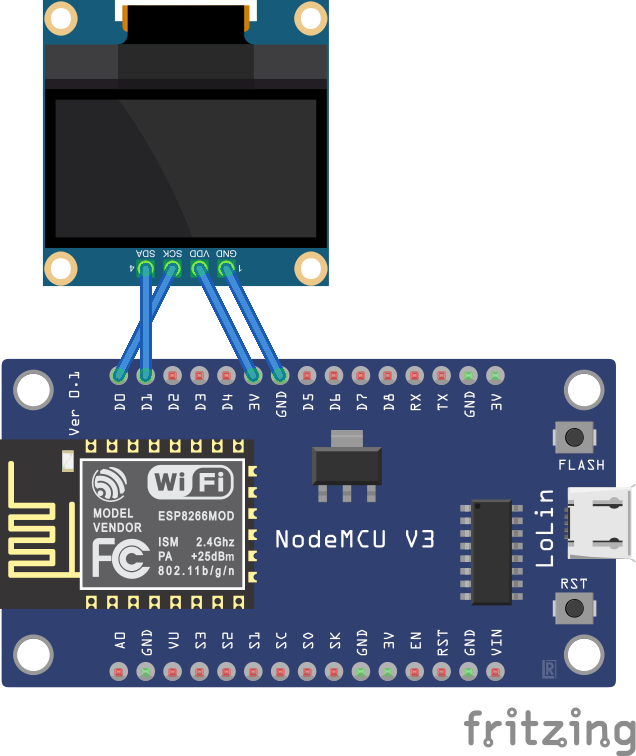

# ESP8266 WiFi Router Monitor

This project is designed to monitor the robustness of your WiFi connection using an **ESP8266** module. It displays key network statistics, such as WiFi signal strength (RSSI), ping results, and connection stability, both on an **OLED LED panel** and through a **web-based HTML/CSS interface**.


## Features
- **OLED Display Panel**: Real-time display of WiFi signal strength, ping status, and ESP8266 IP address.
- **Web-Based Dashboard**: web interface displaying detailed information:
  - WiFi signal strength (RSSI)
  - Ping success or failure to the router
  - Total pings sent
  - Number of failed pings
  - Connection stability percentage
  - ESP8266’s IP address

Once connected to the WiFi, view all statistics on the LED display or access the web interface by connecting to the ESP8266's IP address in your browser.

## Setup Guide

### Requirements
- **ESP8266** (e.g., NodeMCU or similar)
- **0.96" I2C OLED Display (SSD1306)**

### Wiring OLED Display (I2C)
- **VCC** -> 3.3V
- **GND** -> GND
- **SDA** -> D2 (GPIO4)
- **SCL** -> D1 (GPIO5)



### Libraries Needed
Install the following libraries via the Arduino IDE Library Manager:
- `Adafruit GFX`
- `Adafruit SSD1306`
- `ESP8266WiFi`
- `ESP8266Ping`

### Instructions
1. **Connect the OLED Display** to the ESP8266 using the wiring diagram above.
2. Open the **Arduino IDE** and load the provided sketch.
3. Replace the **SSID** and **PASSWORD** with your network credentials:
   ```cpp
   const char* ssid = "your-SSID";
   const char* password = "your-PASSWORD";
   ```
4. Upload the sketch to your ESP8266.
5. Once the ESP8266 connects to WiFi, the **OLED display** will show the WiFi signal strength (RSSI), ping status, and ESP8266’s IP address.
6. Access the web-based panel by opening a browser and typing the ESP8266’s IP address (shown on the OLED display).
7. The **web panel** will show detailed WiFi statistics, including connection stability.

